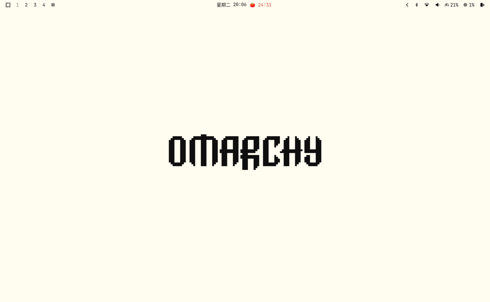

# 🍅 waybar-pomodoro for Omarchy

A classic Pomodoro timer for the [Omarchy](https://omarchy.org/) bar — a native
[Quattro](https://omarchyplugins.com/develop.html) plugin, ported from the
original waybar custom-module app.




## Features

- 🍅 **25 / 5 / 15** Pomodoro technique — work, short break, long break after
  every 4 completed pomodoros
- ⏸️ Pause / resume
- ⏭️ Skip phase (right-click = stop, middle-click = skip, from the bar)
- 🔔 Phase-change notifications with sound
- 🎨 Phase-colored ring in the bar (work = red, short break = green, long
  break = blue, paused = amber) — tinted through the theme
- 💾 State persisted across shell restarts
- 😴 Sleep-safe: after a suspend/resume a running work phase is reset, a
  running break keeps its remaining time

## Install

```sh
omarchy plugin add https://github.com/punkpeye/waybar-pomodoro.git --enable
```

Or, from a local checkout:

```bash
./install.sh
```

## Usage

Click the tomato in the bar to open the timer panel. Click the tomato inside
the panel to start (idle), or press Enter on the Start row.

| Action | Bar mouse | Panel button | Keyboard |
|--------|-----------|--------------|----------|
| Start / Stop | Left click (open panel) · Right click (stop) | ▶ / ■ | Enter on the row |
| Pause / Resume | — | ⏸ | Space |
| Skip phase | Middle click | ⏭ | S |

## Configure

Change the phase lengths and long-break frequency through the widget's config
UI, or with Omarchy:

```sh
omarchy bar set io.github.punkpeye.waybar-pomodoro workMinutes 25
omarchy bar set io.github.punkpeye.waybar-pomodoro shortBreakMinutes 5
omarchy bar set io.github.punkpeye.waybar-pomodoro longBreakMinutes 15
omarchy bar set io.github.punkpeye.waybar-pomodoro pomodorosUntilLong 4
```

New values apply from the next phase onward.

## Keyboard controls

With the panel open: arrows / `h` `j` `k` `l` move between actions, Enter
activates the selected row, **Space pauses/resumes**, `s` skips, Escape
closes, Tab moves to the next bar panel.

You can also control it from a terminal or keybinding:

```sh
omarchy-shell shell toggle io.github.punkpeye.waybar-pomodoro
```

## Move

```sh
omarchy bar move io.github.punkpeye.waybar-pomodoro --section left
```

## Remove

```sh
omarchy plugin remove io.github.punkpeye.waybar-pomodoro
```

## License

MIT — same license as the original [waybar-pomodoro](https://github.com/punkpeye/waybar-pomodoro).
